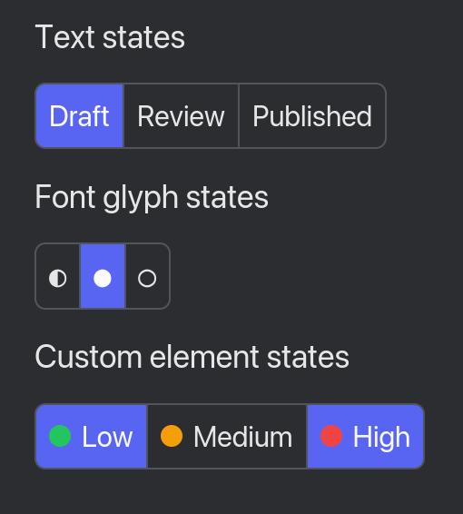

# iced_ntoggle

A segmented toggle/tab widget for [iced](https://github.com/iced-rs/iced), supporting single or multiple selection.



## Usage

```rust
use iced_ntoggle::{Ntoggle, Selection};

Ntoggle::text(["One", "Two", "Three"], Selection::single(0), Message::Toggled)
    .unwrap()
    .into_element();
```

See `examples/` for runnable demos (`demo`, `themed`, `square_borders`):

```sh
cargo run --example demo
```

## Features

- Single or multi selection (with an optional max selection count)
- Build segments from text, glyphs/icons, or arbitrary `Element`s
- Customizable styling via the `Catalog`/`Style` API

## License

No license specified.
